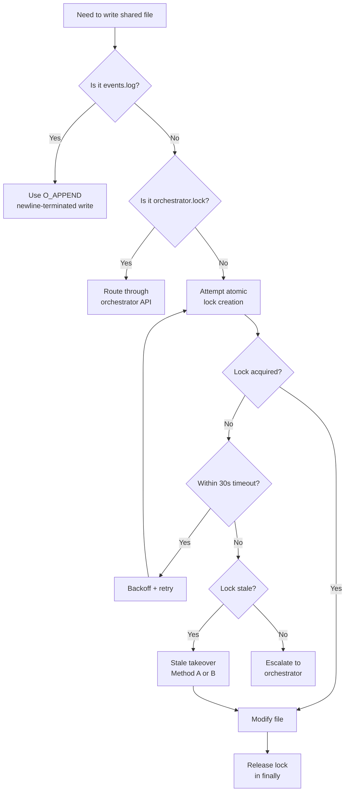

# Concurrency Protocol Reference

This document describes the full file-locking and concurrency protocol used by
Retort agents when accessing shared state files. Agents receive a brief
summary in their persona files; this is the complete reference.

## Overview

Shared state files (`.claude/state/`) are accessed by multiple agents
concurrently. The protocol ensures consistency through:

1. Per-resource file locks (atomic creation)
2. Orchestrator-mediated updates for critical state
3. Append-only operations for event logs
4. Exclusive orchestrator ownership of `orchestrator.lock`

## Lock Acquisition Protocol

### Basic Flow

1. Attempt atomic creation of `.lock` file
2. **Timeout**: 30s hard ceiling (includes all retries)
3. **Retries**: Up to 3 within the 30s window
4. **Backoff**: Exponential — initial 1s, then 2s, then 4s

### Stale-Lock Takeover

Two methods are available depending on platform capabilities:

#### Method A: flock + conditional-unlink (preferred on POSIX)

1. Open the canonical lock path to get file descriptor `fd`
2. Immediately acquire `flock(fd)`
3. Perform `stat(path)` and `fstat(fd)` — compare device/inode to ensure `fd`
   still refers to the canonical path
4. If device/inode mismatch: abort and backoff (another agent replaced the lock)
5. Only after identity matches: check `expiresAt` in file contents
6. If stale: truncate + write new lock contents to the same `fd` (preferred), or
   unlink only after identity check with flock still held
7. Release flock

**Reference order**: `flock` → `stat` → `fstat` → `fd` → `path` → `unlink` →
`expiresAt`

#### Method B: rename-based replacement (platforms without flock)

1. Read and verify the canonical lock is stale (use existing read logic)
2. Create a uniquely-named temp file (e.g., `temp.{agent-id}.{timestamp}`)
3. Write new lock data to the temp file
4. Atomically rename temp → canonical lock path
5. **Do NOT** rename the canonical stale lock to temp first — use atomic rename
   temp → canonical for replacement to avoid overwriting another agent's
   freshly-created lock

### Lock Release

Always release locks in a `finally` block. On repeated failure, escalate to the
orchestrator via the `/orchestrate` endpoint.

## Special Cases

### orchestrator.lock

The `orchestrator.lock` file is **exclusively owned by the orchestrator**. No
other agent may acquire or modify it. Use the orchestrator API (e.g.,
`/orchestrate` endpoint or orchestrator-owned helper) to request writes or
lock acquisition.

### Append-Only Event Log

The `events.log` file uses append-only semantics:

- Relies on `O_APPEND` and newline-terminated, line-based writes
- **Atomicity guarantee**: Applies only to local POSIX filesystems
- `PIPE_BUF` is a pipe/FIFO guarantee — it does **not** apply to regular files
- `O_APPEND` atomicity for regular files depends on the filesystem and kernel
- Platform- and filesystem-dependent atomicity limits apply to write size

**Network filesystems (NFS/SMB/distributed stores)**:

- May not guarantee atomic appends
- When filesystem type is uncertain or `.claude/state/` may be network-mounted,
  use the orchestrator API to append
- Do NOT acquire `orchestrator.lock` directly — route through `/orchestrate` or
  an orchestrator-owned helper to avoid interleaved writes

### Append-Only vs Lock Pattern

- **Append-only operations** to `events.log` are coordinated and do **not**
  require the full acquire → modify → release pattern
- **Non-append writes** or modifications to shared mutable state **must** use
  the full lock pattern: Acquire lock → modify → release lock in finally

## Task Lock Protocol

Tasks in `.claude/state/tasks/` use directory-based locks:

### Lock Metadata

```json
{
  "owner": "<team-id>",
  "acquiredAt": "<ISO-8601>",
  "expiresAt": "<ISO-8601>",
  "ttlMs": 3600000
}
```

- **TTL**: Configurable via `lock_ttl_minutes` (default: 60 minutes)
- **Internal**: `ttlMs = lock_ttl_minutes * 60_000`

### Renewal

If work under lock exceeds 50% of TTL, refresh `expiresAt` before continuing.
If refresh fails or returns a conflict (another agent claimed the lock):

1. Abort the current operation
2. Roll back partial changes
3. Release/clear local lock state
4. Surface an explicit error

Retry/backoff is only allowed for transient errors, not for lease conflicts.

### Rollback Strategy

**Transaction log schema:**

```json
{
  "taskId": "<id>",
  "lockId": "<id>",
  "operations": [
    {
      "action": "create|modify|delete|rename",
      "path": "<file>",
      "tempPath": "<temp>",
      "inverseAction": "<reverse-action>"
    }
  ],
  "timestamps": {},
  "state": "prepared|committed"
}
```

- **Directory**: `.claude/state/tasks/tx/` (configurable)
- **Temp naming**: `{taskId}.{lockId}.{opIndex}.tmp`
- **Two-phase commit**: Prepare (write temps, record tx) → Commit (atomic
  renames) or Rollback (apply inverse ops, remove temps)
- **Cleanup**: `runCleanupOnLeaseFailure(txLogPath)` — read tx log, revert via
  inverse ops, remove temp files. Retry with backoff; record failures to
  metrics/alerts
- **Retention**: Default 24h; configurable via env or config

## Deadlock Mitigation

Rely primarily on:

1. **Timeout-based detection**: Fail fast when lock acquisition exceeds threshold
2. **TTL-based automatic release**: Lock leasing with expiration
3. **Randomized backoff and retries**: Prevent lock convoy

## Flowchart


